# Aperçu de Filoustics

Ce document montre l'application en images, écran par écran, pour donner une vue d'ensemble sans avoir à l'installer. Les captures ci-dessous utilisent des données fictives de démonstration (`npm run demo`), à la fenêtre cible de l'application : **879 × 645 pixels**, dans Microsoft Edge.

## Accueil

L'essentiel en un coup d'œil : prochaine réunion, préparation en attente, prochaines dates et actions en attente. Le bandeau en haut signale automatiquement une réunion qui approche.

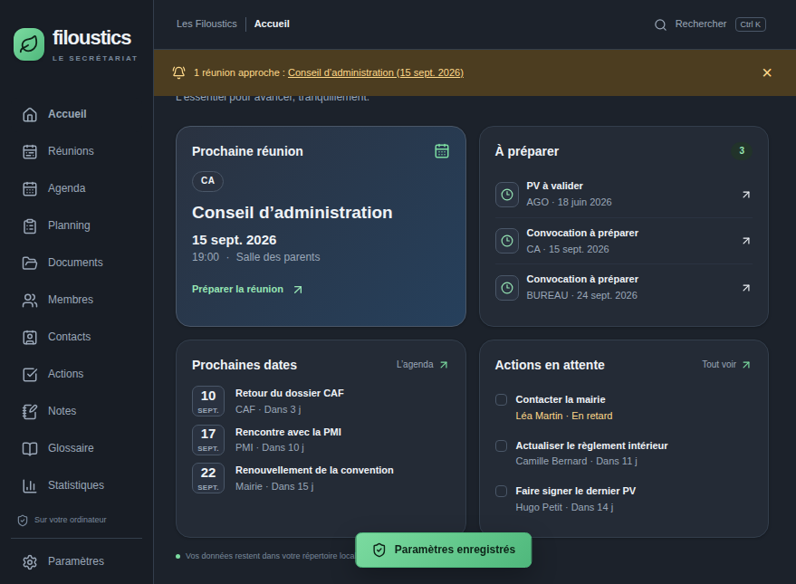

## Réunions

Fiche d'une réunion : résumé, ordre du jour, convocation, PV et documents liés, avec son statut et sa date.

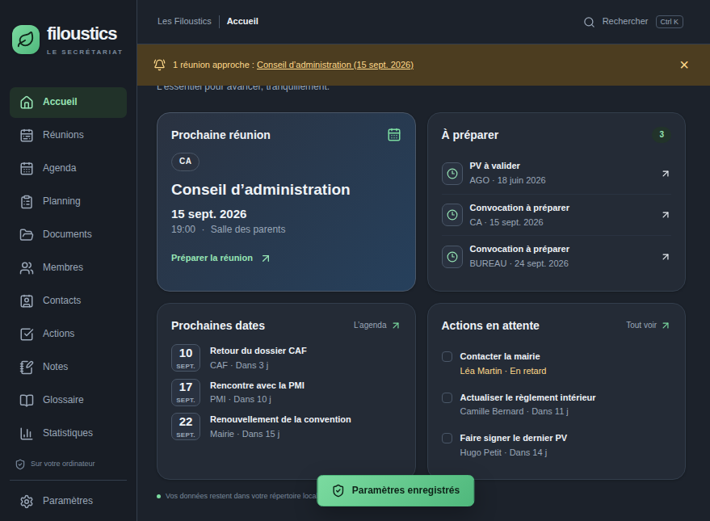
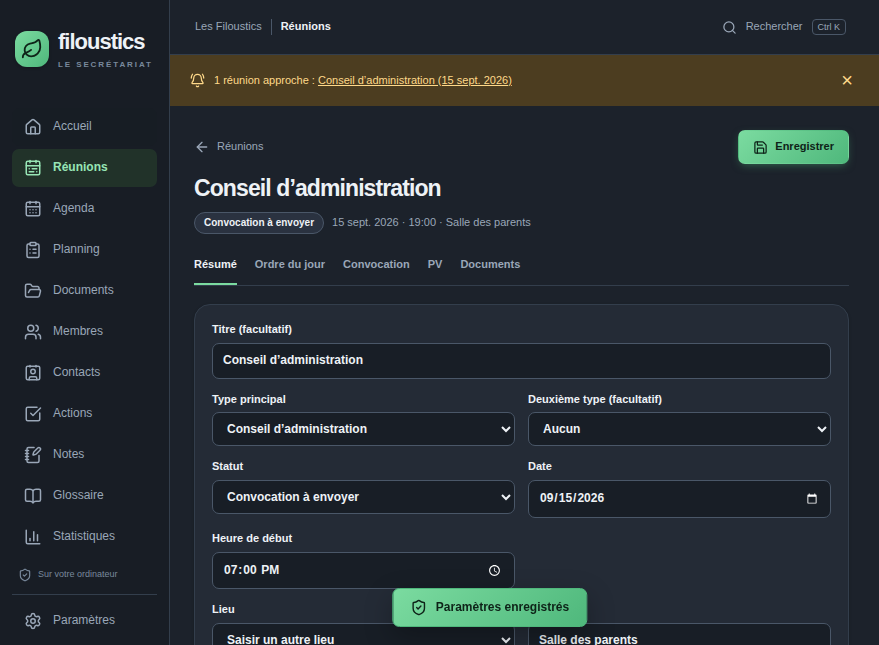

## Agenda

Dates importantes de l'association — échéances administratives, vacances, réunions et actions — réunies dans un même calendrier.

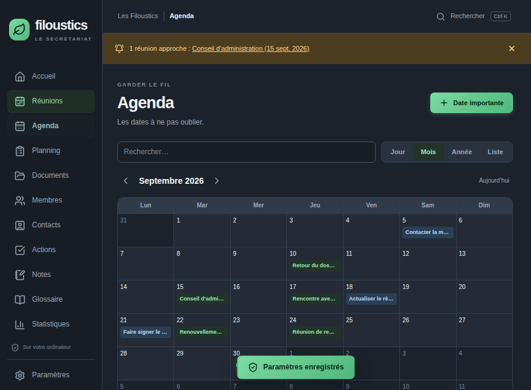

## Planning

Emploi du temps hebdomadaire des créneaux de garde, chacun associé à un membre responsable. Un créneau peut se répéter chaque semaine (icône ↻) ; modifier ou supprimer une occurrence propose ensuite de n'agir que sur celle-ci ou sur elle et toutes les suivantes.

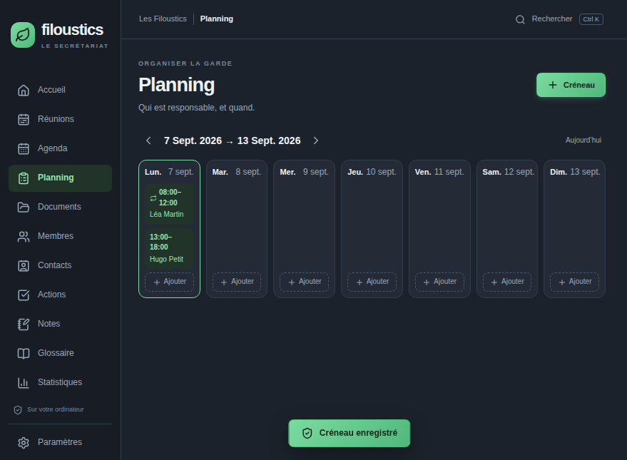
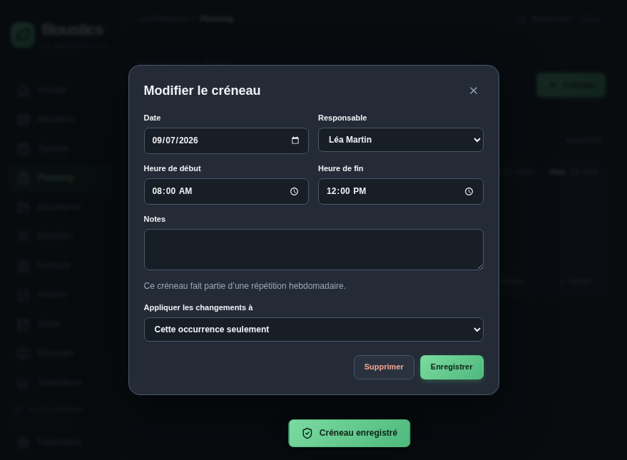

## Documents

Classement des documents de l'association par catégorie, avec archivage et corbeille.

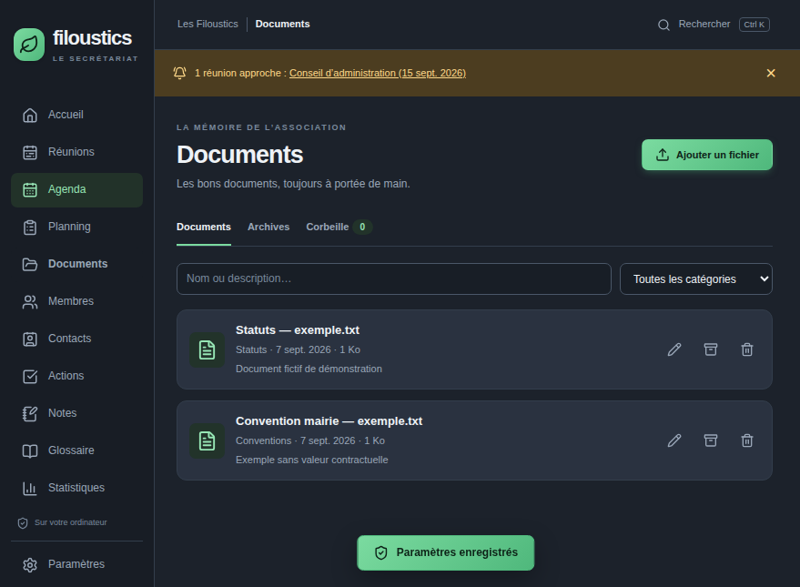

## Membres

Registre des membres de l'association, actifs ou non, avec leur fonction et leurs coordonnées.

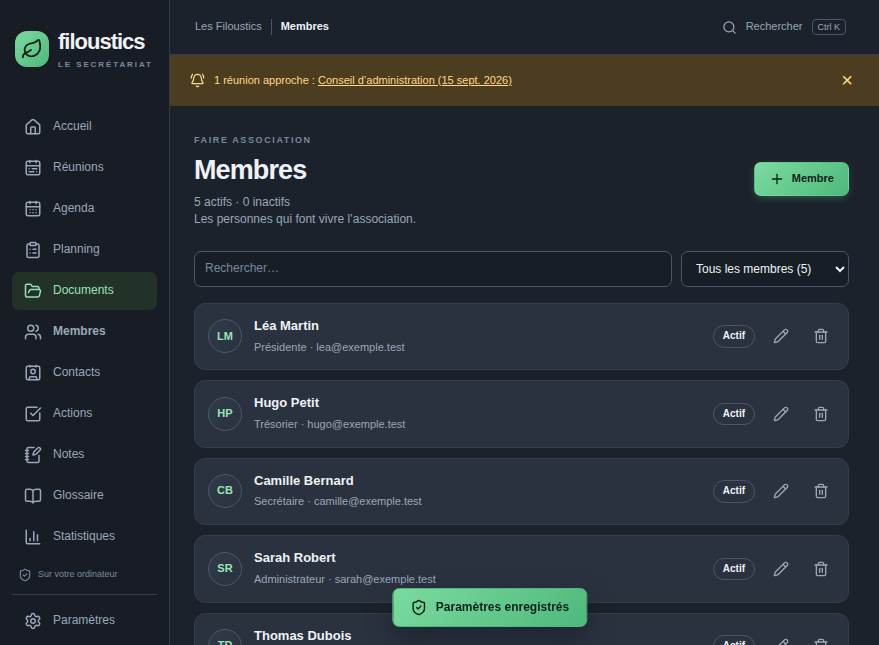

## Contacts

Répertoire des interlocuteurs extérieurs à l'association (CAF, PMI, mairie, assurance...), distinct des membres.

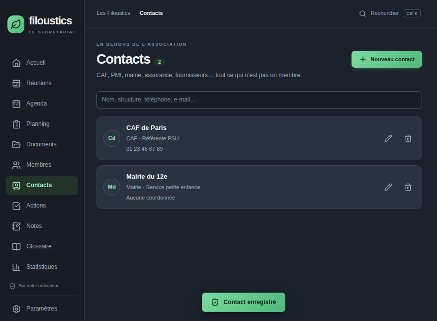

## Actions

Suivi des actions décidées en réunion ou créées librement, avec responsable, échéance et statut.

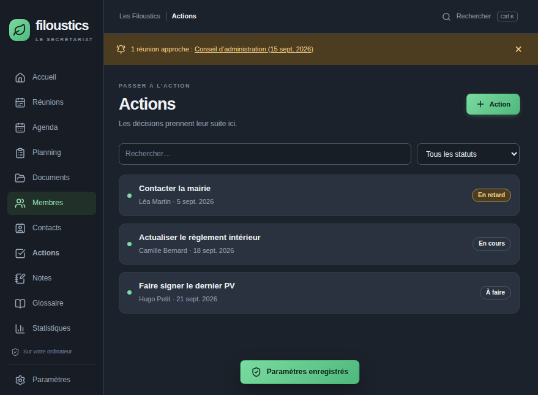

## Notes

Notes libres avec catégorie et niveau d'importance, retrouvables dans la recherche globale.

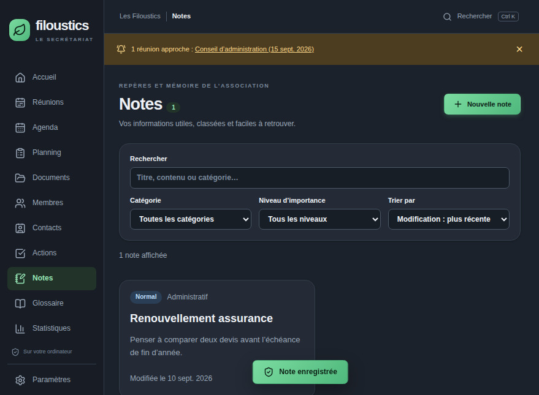

## Glossaire

Définitions des sigles et acronymes de l'association, insérables directement dans un PV en tapant `@clé`.

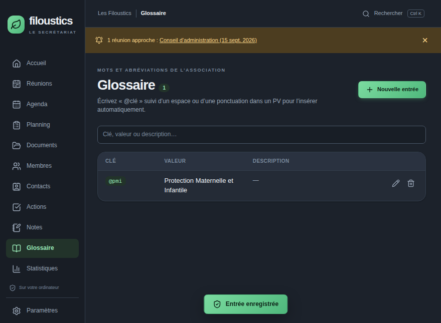

## Statistiques

Indicateurs calculés à partir des données déjà présentes : réunions par statut et par type, taux de présence, actions en retard, membres par fonction, documents par catégorie, garde par responsable, notes par importance.

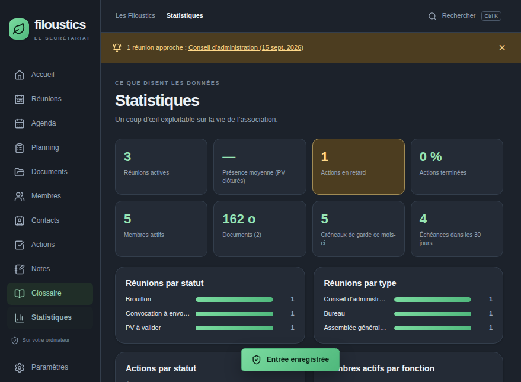

## Paramètres

Informations de l'association, présentation des PDF, réglage du rappel avant une réunion, répertoire de travail et sauvegardes — y compris la sauvegarde hors-site en `.zip`.

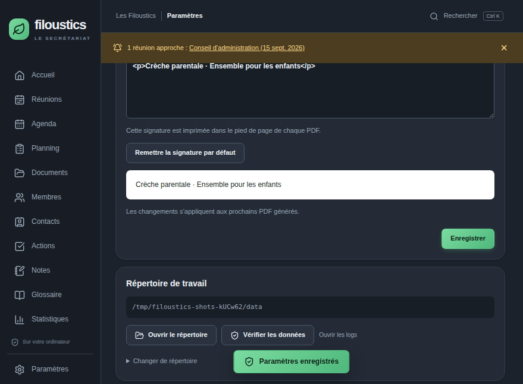
